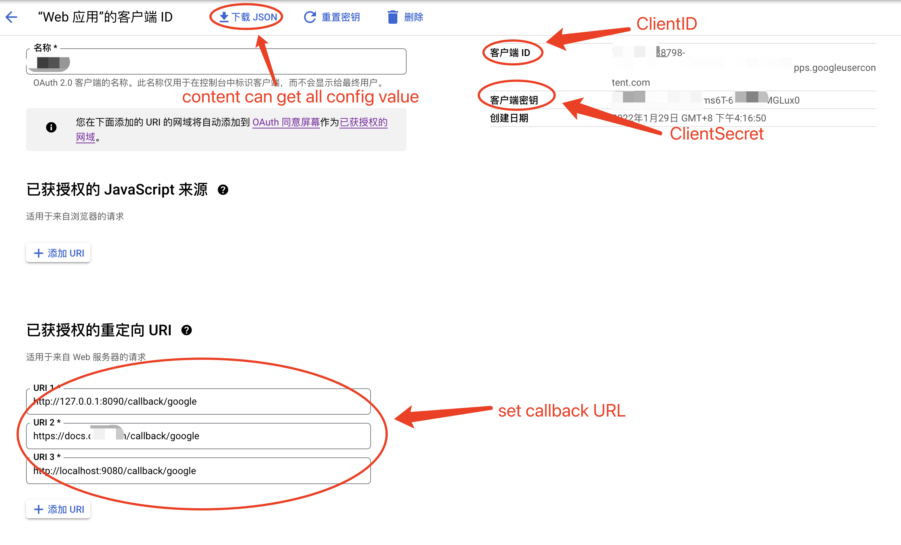
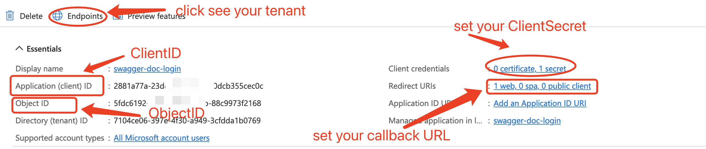
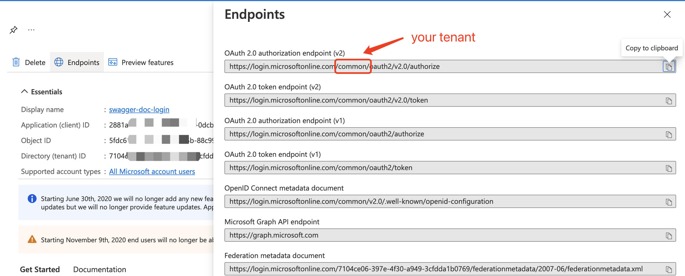

# serve-swagger-ui

A swagger-ui server implemented in go language,
Optional support for Google and Microsoft oAuth login authentication.

After enabling Google or Microsoft oAuth login,
you can set the email or email domain to require authorization to browse documents

## 1、Install

Install using go version 1.16 and above
````
go install github.com/tvb-sz/serve-swagger-ui@latest
````

Or, download binary file from GitHub release then install it
1. Open [https://github.com/tvb-sz/serve-swagger-ui/releases](https://github.com/tvb-sz/serve-swagger-ui/releases)
2. Download the latest binary executable for your OS platform type
3. Place the binary file in the environment variable directory, or add the directory where the binary file is located to the environment variable, for example `/usr/local/bin`

enjoy it~

## 2、Config

#### 2.1、only command line arguments

use `-h` see detail

````
Flags:
      --config string      Specify a TOML configuration file, default conf.toml
  -h, --help               help for serve-swagger-ui
      --host string        Specify the host for the web service, default 0.0.0.0
      --log_level string   Specify log level, override config file value：debug|info|warn|error|panic|fatal
      --log_path string    Specify log storage location, override config file value: stderr|stdout|-dir-path-
      --open bool          Automatically open the browser and show the first doc
      --path string        Specify the swagger JSON file storage path, default ./
      --port int           Specify the port for the web service, default 9080
````

> `--open` can be used to automatically open the default browser and display the first Swagger JSON file

All command line arguments can be omitted

#### 2.2、TOML config file

see `stubs/conf.toml.example`
or use sub-command `output_conf` to output all `.toml` file content

````
# this sub-command will output all config content
# copy the output to create a new Configuration file for .toml suffix
serve-swagger-ui output_conf

# or output to a file
serve-swagger-ui output_conf >> conf.toml
````

use `--config` specifies the configuration file

use `conf.toml` file name and placed in the same directory as the executable binary can omit `--config`

#### 2.3、mixed

Can use both configuration files and command line arguments

Command line parameters take precedence, configuration file related values will be ignored

## 3、Publicly accessible

only use command line arguments or do not set config file of section `[Google]` and `[Microsoft]`

## 4、Authenticate with Google oAuth Login

#### step1、create Google oauth web application

create Web Application in Google console, see: [https://console.cloud.google.com/apis/credentials](https://console.cloud.google.com/apis/credentials)

you will get the Google oauth client_id and client_secret

#### step2、set config

edit your `.toml` suffix config file, see: [2.2、TOML config file](#22toml-config-file)

1. set `Server.BaseURL` which is your server bind domain base URL, such as `https://swagger.tvb.com/`
2. set `Server.JwtKey` which is the JWT encryption key used to authenticate the cookie, any character 8 to 16 characters long
3. set `Server.JwtExpiredTime` which is Authorization cookie validity period, how many seconds after the token is issued
4. set `Google.ClientID` and `Google.ClientSecret` obtained in the first step

App information sample


#### step3、set callback URL in Google console

set your oauth callback URL in Google oauth console, see: [https://console.cloud.google.com/apis/credentials](https://console.cloud.google.com/apis/credentials)

The callback URL splicing format is: `Server.BaseURL` + `callback/google`,  such as `https://swagger.tvb.com/callback/google`

#### step4、set allowed login email address or email address domain 

use `Account.Domain` set up authoritative domains,
All email address under the set domain can be authorized, 
such as `tvb.com`, then all email address with suffix used `tvb.com` can log in

> You can set multiple domain, so you need to use an array of square brackets

use `Account.Email` specify one or more email addresses that can be authorized
such as `webmaster@tvb.com`, then `webmaster@tvb.com` full match email address can log in

> You can set multiple email address, so you need to use an array of square brackets

## 5、Authenticate with Microsoft oAuth Login

#### step1、create Microsoft oauth web application

1. prepare your Microsoft Azure account then enter [App registrations](https://portal.azure.com/?l=en.en-us#blade/Microsoft_AAD_IAM/ActiveDirectoryMenuBlade/RegisteredApps)
2. Click `New Registration` to register your microsoft oAuth login app
3. back up to [App registrations](https://portal.azure.com/?l=en.en-us#blade/Microsoft_AAD_IAM/ActiveDirectoryMenuBlade/RegisteredApps) you will see your oAuth app item
4. click your app name will enter app information page, then you can see all config information
5. after clicking `Endpoints`, a block will pop up on the right, and you can see your `tenant` value
6. Click the hyperlink behind `Client credentials` and create a new `client_secret` after entering

#### step2、set config

edit your `.toml` suffix config file, see: [2.2、TOML config file](#22toml-config-file)

1. set `Server.BaseURL` which is your server bind domain base URL, such as `https://swagger.tvb.com/`
2. set `Server.JwtKey` which is the JWT encryption key used to authenticate the cookie, any character 8 to 16 characters long
3. set `Server.JwtExpiredTime` which is Authorization cookie validity period, how many seconds after the token is issued
4. set `Microsoft.ClientID`、`Microsoft.ClientSecret`、`Microsoft.Tenant`obtained in the first step

App information sample


Get your tenant value sample


#### step3、set callback URL in Microsoft console

Click the hyperlink behind `Redirect URIs` and `Add a platform` for `Web`

If it has been added, click `Add URI` to enter the callback URL

The callback URL splicing format is: `Server.BaseURL` + `callback/microsoft`,  such as `https://swagger.tvb.com/callback/microsoft`

#### step4、set allowed login email address or email address domain

Refer to the description of `Authenticate with Google oAuth Login` above

## 6、Serve multiple swagger JSON files

> Thanks to [fsnotify](https://github.com/fsnotify/fsnotify), adding or removing swagger json file does not require restarting the process

use `--path` or `Swagger.Path` Specify the directory path where the swagger JSON files is located

You can use a subdirectory to group multiple swagger JSON files.

The first-level subdirectory name will be automatically used as a group name
and those without a first-level subdirectory will be use `default` as group name.

**use `--path=./runtime` as an example:**
````
 ├── runtime
 │   ├── Defined
 │   │   ├── 1.json
 │   │   └── sub
 │   │        └── 2.json
 │   ├── 3.json
 │   └── 4.json
````
there will be TWO group:
1. `Defined` : contain `1.json` and `2.json`
2. `default` : contain `3.json` and `4.json`
